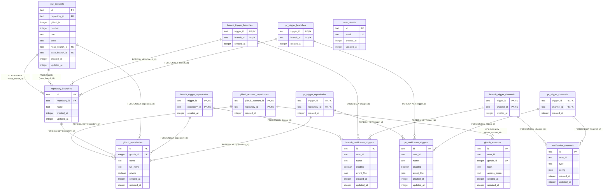

```mermaid
erDiagram
    github_account_repositories ||--o{ github_accounts : "FOREIGN KEY (github_account_id)"
    github_account_repositories ||--o{ github_repositories : "FOREIGN KEY (repository_id)"

    repository_branches ||--o{ github_repositories : "FOREIGN KEY (repository_id)"

    pull_requests ||--o{ github_repositories : "FOREIGN KEY (repository_id)"
    pull_requests ||--o{ repository_branches : "FOREIGN KEY (head_branch_id)"
    pull_requests ||--o{ repository_branches : "FOREIGN KEY (base_branch_id)"

    branch_trigger_repositories ||--o{ branch_notification_triggers : "FOREIGN KEY (trigger_id)"
    branch_trigger_repositories ||--o{ github_repositories : "FOREIGN KEY (repository_id)"

    branch_trigger_branches ||--o{ branch_notification_triggers : "FOREIGN KEY (trigger_id)"
    branch_trigger_branches ||--o{ repository_branches : "FOREIGN KEY (branch_id)"

    branch_trigger_channels ||--o{ branch_notification_triggers : "FOREIGN KEY (trigger_id)"
    branch_trigger_channels ||--o{ notification_channels : "FOREIGN KEY (channel_id)"

    pr_trigger_repositories ||--o{ pr_notification_triggers : "FOREIGN KEY (trigger_id)"
    pr_trigger_repositories ||--o{ github_repositories : "FOREIGN KEY (repository_id)"

    pr_trigger_branches ||--o{ pr_notification_triggers : "FOREIGN KEY (trigger_id)"
    pr_trigger_branches ||--o{ repository_branches : "FOREIGN KEY (branch_id)"

    pr_trigger_channels ||--o{ pr_notification_triggers : "FOREIGN KEY (trigger_id)"
    pr_trigger_channels ||--o{ notification_channels : "FOREIGN KEY (channel_id)"

    user_details {
        text id PK
        text email UK
        integer created_at
        integer updated_at
    }

    github_accounts {
        text id PK
        text user_id
        integer github_id UK
        text login
        text access_token
        integer created_at
        integer updated_at
    }

    github_repositories {
        text id PK
        integer github_id UK
        text name
        text full_name
        boolean private
        integer created_at
        integer updated_at
    }

    github_account_repositories {
        text github_account_id PK,FK
        text repository_id PK,FK
        integer created_at
    }

    repository_branches {
        text id PK
        text repository_id FK
        text name
        integer created_at
        integer updated_at
    }

    pull_requests {
        text id PK
        text repository_id FK
        integer github_id
        integer number
        text title
        text state
        text head_branch_id FK
        text base_branch_id FK
        integer created_at
        integer updated_at
    }

    notification_channels {
        text id PK
        text user_id
        text type
        json config
        integer created_at
        integer updated_at
    }

    branch_notification_triggers {
        text id PK
        text user_id
        text name
        boolean enabled
        json event_filter
        integer created_at
        integer updated_at
    }

    pr_notification_triggers {
        text id PK
        text user_id
        text name
        boolean enabled
        json event_filter
        integer created_at
        integer updated_at
    }

    branch_trigger_repositories {
        text trigger_id PK,FK
        text repository_id PK,FK
        integer created_at
    }

    branch_trigger_branches {
        text trigger_id PK,FK
        text branch_id PK,FK
        integer created_at
    }

    branch_trigger_channels {
        text trigger_id PK,FK
        text channel_id PK,FK
        integer created_at
    }

    pr_trigger_repositories {
        text trigger_id PK,FK
        text repository_id PK,FK
        integer created_at
    }

    pr_trigger_branches {
        text trigger_id PK,FK
        text branch_id PK,FK
        integer created_at
    }

    pr_trigger_channels {
        text trigger_id PK,FK
        text channel_id PK,FK
        integer created_at
    }
``` 